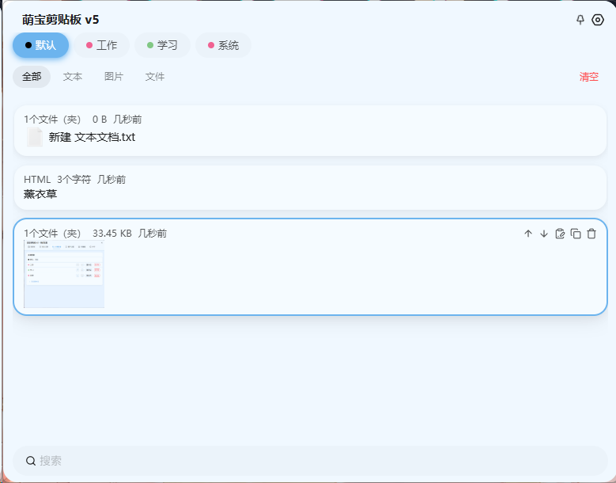
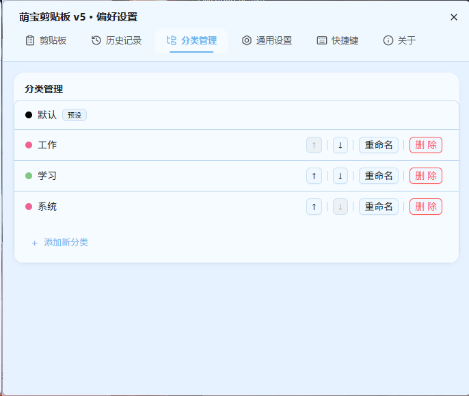
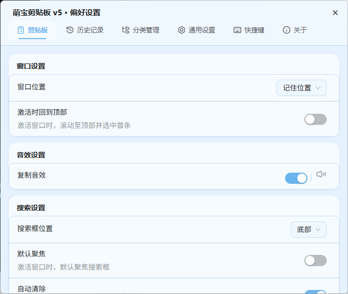
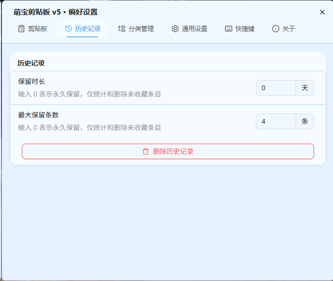
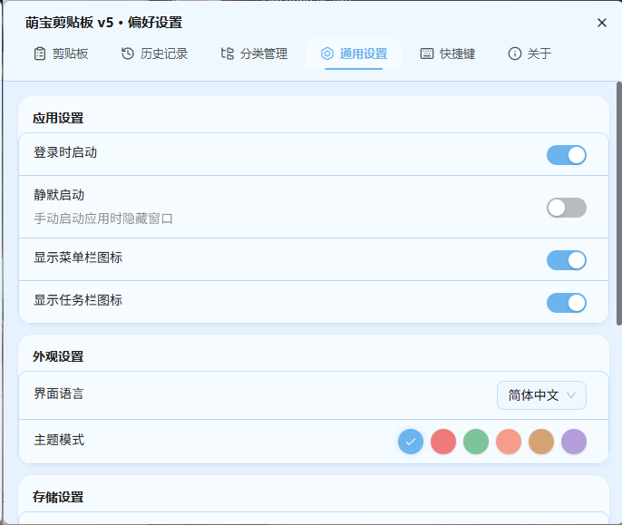
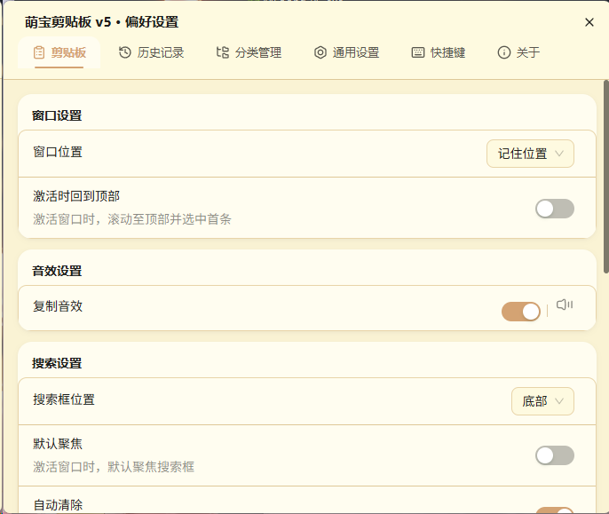
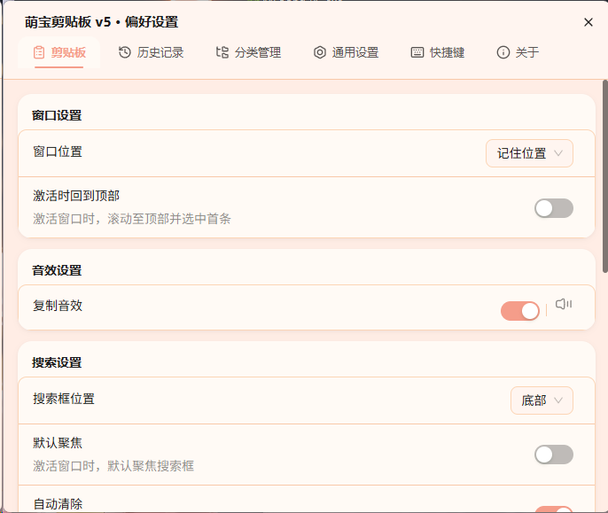
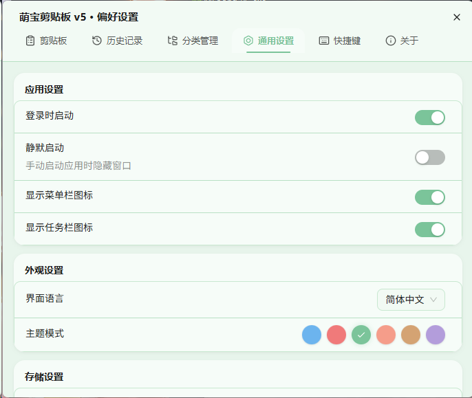

# 🐱 萌宝剪贴板

> 可可爱爱的跨平台剪贴板管理工具 · 基于 Tauri v2



---

## ✨ 特色功能

| | 功能 | 说明 |
|---|---|---|
| 📋 | **剪贴板管理** | 自动记录复制的内容，支持文本/图片/文件 |
| 🗂️ | **分类管理** | 自定义分类 + 子分类（全部/文本/图片/文件） |
| 🔍 | **搜索过滤** | 快速搜索历史剪贴板内容 |
| 🎨 | **可爱主题** | 6 种配色主题，总有一款你喜欢 |
| 🔄 | **内容排序** | 拖拽排序 + 一键上移下移 |
| 🖱️ | **双击粘贴** | 双击内容自动粘贴到当前窗口 |
| 💾 | **备份恢复** | 一键备份/恢复所有数据 |
| 🚀 | **系统托盘** | 后台运行，右键菜单快捷操作 |

## 🖼️ 功能截图

| 主界面 | 分类管理 | 偏好设置 |
|---|---|---|
|  |  |  |

| 历史记录 | 通用设置 | 关于 |
|---|---|---|
|  |  |  |

### 🎨 主题预览

| 奶油猫 | 蜜桃乌龙 | 薰衣草 | 晴空 | 沙滩 | 抹茶 |
|---|---|---|---|---|---|
|  |  |  |  |  |  |

## 📦 下载

[👉 点击下载最新版](https://github.com/YOUR_USERNAME/YOUR_REPO/releases/latest)

仅提供 Windows 安装包，~~Mac 和 Linux 用户自己编译吧~~ 😅

## 🛠️ 技术栈

- **前端**: React + TypeScript + Vite + UnoCSS + Ant Design
- **后端**: Rust + Tauri v2
- **数据库**: SQLite (通过 tauri-plugin-sql)
- **图标**: Hugeicons + Lucide + Iconamoon

## 🔧 本地开发

```bash
# 1. 安装依赖
pnpm install

# 2. 启动开发模式
pnpm tauri dev

# 3. 打包正式版
pnpm tauri build --no-bundle
# 然后用 Inno Setup 打包或直接运行 exe
```

## 📄 许可证

本项目基于 [Apache 2.0](LICENSE) 许可证发布。

基于 [EcoPaste](https://github.com/ayangweb/EcoPaste) 修改，感谢原作者的出色工作。

---

**萌宝剪贴板** · 希望能给你带来便捷与好心情 ✨
