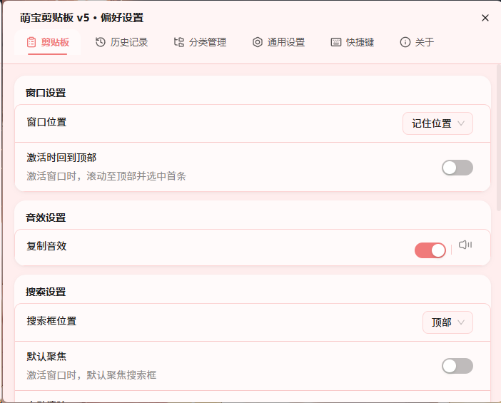
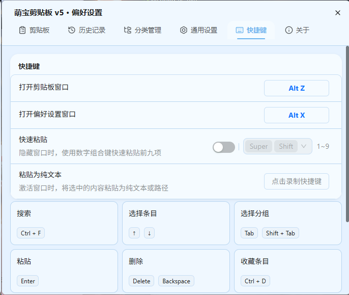

# 🐱 萌宝剪贴板

> 可可爱爱的剪贴板管理工具 · 基于 Tauri v2  
> *让你的复制粘贴变得优雅又治愈 ✨*

<p align="center">
  
</p>

---

## 📖 介绍

萌宝剪贴板是一款**轻量、可爱、高效**的剪贴板管理工具。

它静静地躺在你的系统托盘里，默默记录你复制过的每一段文字、每一张图片、每一个文件。当你需要它们的时候，一键就能找回来——**再也不用担心复制的内容被覆盖了。**

---

## ✨ 功能特性

### 📋 智能剪贴板

| 功能 | 说明 |
|---|---|
| 🪄 **自动记录** | 复制即记录，无需手动操作 |
| 🔍 **快速搜索** | 输入关键词秒搜历史记录 |
| 🖱️ **双击粘贴** | 双击条目自动粘贴到当前窗口 |
| 🔄 **自由排序** | 拖拽排序 + 一键上移/下移 |


### 🗂️ 双层分类系统

**主分类**：默认 / 工作 / 学习 / 等等（支持自定义 + 删除）
**子分类**：全部 / 文本 / 图片 / 文件

> 在「工作」→「图片」中快速找到工作截图  
> 在「学习」→「文本」中翻阅昨天的笔记


### 🎨 6 种可爱主题

| 奶油猫 | 蜜桃乌龙 | 薰衣草 |
|---|---|---|
|  |  |  |
| 温暖奶白，经典耐看 | 粉嫩蜜桃，少女心爆棚 | 优雅紫色，治愈感满满 |

| 晴空 | 抹茶 | 珊瑚 |
|---|---|---|
|  |  |  |
| 清爽蓝色，心情变好 | 清新绿色，自然舒适 | 热情活力，眼前一亮 |

### 💾 备份与恢复

一键备份所有偏好设置和剪贴板内容，支持随时恢复到任意备份版本，数据安全无虞。

### 🚀 系统托盘

- 后台运行，不占任务栏
- 右键菜单：偏好设置 / 开关监听 / 重启 / 退出
- 全局快捷键一键唤醒

---

## 🖼️ 更多界面

| 历史记录 | 偏好设置首页 | 快捷键 |
|---|---|---|
|  |  |  |

| 通用设置 | 关于软件 |
|---|---|
|  |  |

---

## 🆕 v5.0.0 - 正式版

> 🎉 萌宝剪贴板 v5 正式发布！基于 EcoPaste 深度定制，带来更可爱的剪贴板体验 ✨

### ✨ 主要更新
- 🐱 **全新萌宝品牌** - 基于 EcoPaste 二次开发，打造专属萌宝剪贴板
- 🎨 **6 种可爱主题** - 奶油猫 / 蜜桃乌龙 / 薰衣草 / 晴空 / 抹茶 / 珊瑚
- 📋 **智能剪贴板管理** - 自动记录、快速搜索、双击粘贴
- 🗂️ **双层分类系统** - 主分类 + 子分类，高效整理剪贴板内容
- 💾 **备份与恢复** - 一键备份所有偏好设置和剪贴板内容
- 🚀 **系统托盘常驻** - 后台运行，全局快捷键一键唤醒
- 🖼️ **截图优化** - 压缩并优化所有界面截图资源

### 🛠️ 技术升级
- 基于 **Tauri v2 + Rust** 构建，性能更优、体积更小
- 前端采用 **React + TypeScript + Vite**
- 样式使用 **UnoCSS + Ant Design**

---

## 📦 下载

[👉 下载萌宝剪贴板 v5.0.0](https://github.com/ruizznav/MengBao_Clipboard_Setup/releases/latest)

**支持平台**：Windows 10/11 64 位

---

## 🛠️ 技术栈

```
前端    React + TypeScript + Vite
样式    UnoCSS + Ant Design
后端    Rust + Tauri v2
数据库  SQLite
图标    Hugeicons + Lucide
```

---

## 🔧 本地构建

```bash
# 克隆
git clone https://github.com/ruizznav/MengBao_Clipboard_Setup.git
cd MengBao_Clipboard_Setup

# 安装
pnpm install

# 开发
pnpm tauri dev

# 打包
pnpm tauri build --no-bundle
# 然后使用 Inno Setup 打包安装包
```

---

## 📄 使用说明

[ 使用说明 ](https://github.com/ruizznav/MengBao_Clipboard_Setup/blob/main/%E4%BD%BF%E7%94%A8%E8%AF%B4%E6%98%8E.md)


---

## 📄 开源协议

本项目基于 [Apache 2.0](LICENSE) 协议发布，基于 [EcoPaste](https://github.com/ayangweb/EcoPaste) 修改，感谢原作者的出色工作。

---

<p align="center">
  <sub>Made with 💕 by Ruizz</sub>
  <br>
  <sub>希望它能给你带来便捷与好心情 ✨</sub>
</p>
